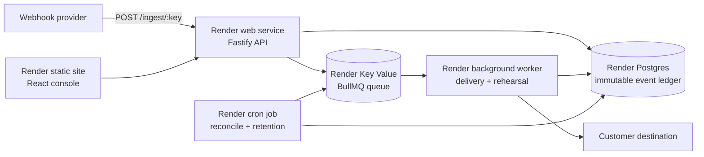

# Replay Room

[](https://github.com/abhid1234/replay-room/actions/workflows/ci.yml)

**Rehearse a failed webhook before you replay it.**

Replay Room is an operator console for the dangerous moment after an event lands in a dead-letter queue. It preserves the original payload, records every delivery attempt, requires a successful rehearsal against the exact destination and payload hash, and only then allows an audited replay.

This is a portfolio project built to exercise Render as a platform, not merely run one process on it.

## Why this project

Recent developer discussions keep converging on the same operational gap: receiving a webhook is easy; proving that a failed event is safe to replay is not. Basic inspectors can capture and resend. Replay Room adds the part an incident operator needs:

- immutable receipt of the original event;
- idempotency-aware ingestion;
- async delivery with exponential backoff and jitter;
- a dead-letter state with complete attempt history;
- rehearsal against a controlled endpoint;
- a replay guard that binds approval to the rehearsed payload hash and destination;
- operator reason and append-only audit history;
- scheduled reconciliation for stuck deliveries and events stranded between the database and queue.

The research and product decisions are captured in [docs/RESEARCH.md](docs/RESEARCH.md).

## The incident flight recorder

The public dashboard opens with an interactive outage drill that follows a payment event through the real lifecycle vocabulary: durable receipt, worker claim, receiver failure, retry exhaustion, rehearsal, replay guard, and production delivery. It is explicitly labeled as a simulation and requires an operator action to run.

For live events, the API computes a deterministic diagnosis from the current state and attempt transcript. It distinguishes receiver outages, rate limiting, contract rejection, network failure, active recovery, and healthy delivery, then gives the operator evidence and a concrete next action. The rules are explainable and tested; no external model or hidden prompt decides whether a replay is safe.

The authenticated console also reads a live runtime snapshot instead of presenting a decorative architecture diagram. Postgres and Key Value latency come from direct dependency checks, BullMQ reports waiting/active/delayed/failed job counts, and the background worker and cron reconciler publish expiring heartbeats. On Render, the panel includes the service, instance, and Git commit injected into the running API.

Every incident can be downloaded as a signed evidence bundle. The JSON includes the original event identity and payload digest, diagnosis, full attempt transcript, rehearsal records, and audit history. A canonical HMAC-SHA256 seal detects any later modification. Endpoint signing secrets are never returned by the admin API or included in exports; the server reports only whether a secret is configured.

Operators with access to the deployment's evidence key can verify an exported bundle offline:

```bash
EVIDENCE_SIGNING_SECRET="$EVIDENCE_SIGNING_SECRET" npm run evidence:verify -- ./incident.evidence.json
```

The command prints machine-readable JSON and exits non-zero for a modified or malformed bundle.

The endpoint runway turns the durable ledger into a 24-hour reliability view for each destination. It reports event volume, terminal-delivery success rate, retrying and dead-letter counts, and p95 latency from successful live or replay attempts. Queued and in-flight events remain visible without incorrectly lowering the success rate.

Public ingest is protected by an atomic per-endpoint limit in Render Key Value. The default allows 600 requests per minute, works across horizontally scaled API instances, and returns `X-RateLimit-Limit`, `X-RateLimit-Remaining`, and `Retry-After` headers. Redis stores only a short hash of the ingest key, not the key itself.

## Render architecture



The root [render.yaml](render.yaml) creates the entire topology as one Blueprint:

| Render primitive | Replay Room responsibility |
|---|---|
| Static site | Operator dashboard |
| Web service | Public ingest and admin API |
| Background worker | Delivery, retry, rehearsal, and replay |
| Postgres | Durable event, attempt, rehearsal, and audit ledger |
| Key Value | BullMQ work queue and delayed retries |
| Cron job | Stuck-delivery reconciliation and retention |
| Preview environment | Disposable full-stack environment for PR testing |

## The guarded replay invariant

A replay is accepted only when all of these are true:

1. The event is in `dead_letter` state.
2. An operator supplied a meaningful reason and identity.
3. The latest rehearsal succeeded.
4. The event payload hash still matches the rehearsed hash.
5. The production replay destination exactly matches the rehearsed destination.

Every approval and rejection is written to the audit log. The guard is deterministic and covered by unit tests.

## Quick start

Prerequisites: Node.js 22+, Docker, and Docker Compose.

```bash
cp .env.example .env
docker compose up -d
npm install
npm run db:migrate
npm run db:seed
```

Run the three processes in separate terminals:

```bash
npm run dev
npm run dev:worker
npm run dev:web
```

Open `http://localhost:5173`, enter the `ADMIN_TOKEN` from `.env`, and create an endpoint. For local failure testing, use one of the built-in development sinks:

- `http://localhost:4000/demo/sink/accept`
- `http://localhost:4000/demo/sink/retry`
- `http://localhost:4000/demo/sink/reject`

Send an event:

```bash
curl -X POST http://localhost:4000/ingest/YOUR_INGEST_KEY \
  -H 'content-type: application/json' \
  -H 'idempotency-key: checkout-1042' \
  -d '{"type":"checkout.completed","orderId":"ord_1042","amount":12900}'
```

## API surface

| Method | Path | Purpose |
|---|---|---|
| `GET` | `/health` | Database-backed health check |
| `POST` | `/ingest/:ingestKey` | Accept and deduplicate an event |
| `GET` | `/api/stats` | Dashboard status counts |
| `GET` | `/api/system` | Dependency latency, queue pressure, service heartbeats, and deploy identity |
| `GET/POST` | `/api/endpoints` | List or create ingest endpoints |
| `GET` | `/api/endpoints/reliability` | Per-destination volume, delivery rate, recovery state, and p95 latency |
| `GET` | `/api/events` | List recent events |
| `GET` | `/api/events/:id` | Event, attempts, rehearsals, and audit trail |
| `GET` | `/api/events/:id/evidence` | Download the HMAC-sealed incident evidence bundle |
| `POST` | `/api/events/:id/rehearse` | Queue a safe rehearsal |
| `POST` | `/api/events/:id/replay` | Run the replay guard and queue an approved replay |

Admin routes require `Authorization: Bearer $ADMIN_TOKEN`. Set `x-operator` when taking an operator action.

## Security boundaries

- Sensitive request headers are redacted before storage.
- Endpoint signing secrets remain server-side and are redacted from every API response and evidence export.
- Payloads are capped at 256 KiB by default.
- Per-endpoint ingest limits reject overload before database or queue writes.
- Generic HMAC verification is supported with `x-replay-signature: sha256=<digest>`.
- Literal and DNS-resolved private, loopback, link-local, reserved, credential-bearing, and non-HTTP destinations are blocked in production.
- Network calls time out after 10 seconds.
- Response bodies are truncated before storage.
- Replays cannot bypass rehearsal, payload binding, destination binding, or dead-letter state.
- Incident exports use a separately generated evidence-signing secret and disable response caching.

This is an early-stage project. Production hardening would add organization-scoped authorization, encryption for stored payloads and endpoint secrets, DNS pinning to remove the residual lookup-to-connect rebinding window, and configurable retention by tenant.

## Verification

```bash
npm run verify
```

The verification gate type-checks the API/worker/cron code, runs domain, API, delivery, diagnosis, and heartbeat tests, and builds the production API and dashboard bundles.

GitHub Actions runs the same gate on every branch push and pull request, audits production dependencies at high severity, and builds the release Docker image on a clean Linux runner.

## Interview walkthrough

1. Run the public outage drill and narrate how each checkpoint maps to Render.
2. Send a webhook to the `retry` demo sink and show the immediate `202` response.
3. Let the worker exhaust retries into `dead_letter`.
4. Open the flight-recorder diagnosis and complete attempt timeline.
5. Rehearse against the accepting sink.
6. Try to replay to a different destination and show the deterministic guard rejection.
7. Replay to the rehearsed destination with an operator reason.
8. Open `render.yaml` and map each behavior to its Render service.

## Status

Version `0.1.0` is a production-shaped first implementation. It is ready for local verification and a first Render Blueprint deployment; it is not represented as a production-tested managed service.

## License

MIT
