# Architecture and failure model



## Lifecycle

```text
received -> queued -> delivering -> delivered
                         |
                         +-> retrying -> delivering
                         |
                         +-> dead_letter -> rehearsal -> guarded replay -> delivered
```

The API acknowledges only after Postgres stores the event and BullMQ accepts the delivery job. Delivery failures never delete or overwrite the received record.

## Delivery semantics

Replay Room provides at-least-once delivery. It does not claim exactly-once side effects. Receivers must deduplicate with the stable event ID or supplied idempotency key.

Retryable outcomes:

- network and timeout failures;
- HTTP 408, 425, and 429;
- HTTP 5xx.

Other HTTP 4xx responses are treated as permanent failures and dead-lettered immediately. Retry delays use bounded exponential backoff with jitter.

## Ingest admission control

After resolving a valid endpoint but before signature verification or database writes, the API consumes a fixed-window counter in Key Value. A Lua script performs `INCR`, first-write expiry, and TTL read atomically, so multiple Render web-service instances share one limit. Counter keys contain a truncated SHA-256 digest of the ingest key.

The default window is 600 requests per minute per endpoint and is configurable with `INGEST_RATE_LIMIT_PER_MINUTE`. Rejected requests return HTTP 429 plus remaining-budget and retry timing headers; they never enter Postgres or BullMQ.

The operator surface has a second Redis-backed limiter applied globally before protected route handlers. It prevents repeated dashboard or API reads from creating unbounded Postgres work. The default is 300 requests per minute per client and is configurable with `OPERATOR_RATE_LIMIT_PER_MINUTE`.

## Outbound network boundary

Endpoint creation rejects private IP literals, local hostnames, URL credentials, and non-HTTP protocols. Immediately before every live delivery, rehearsal, or replay, the worker resolves the hostname and rejects any answer in loopback, private, carrier-grade NAT, link-local, multicast, or reserved space. A security rejection is recorded as a terminal attempt and dead-lettered instead of entering a retry loop.

This preflight materially reduces SSRF exposure but does not pin the subsequent connection to the inspected address. A hardened multi-tenant deployment should add a custom DNS-pinning HTTP dispatcher or an egress proxy to close that lookup-to-connect rebinding window.

## Rehearsal contract

A rehearsal sends the original payload with `x-replay-room-mode: rehearsal` to an operator-selected endpoint. The evidence record binds:

- event ID;
- payload SHA-256;
- exact destination URL;
- response status;
- timestamp and notes.

Production replay requires a passing record with the same payload digest and destination. This intentionally makes target changes force a new rehearsal.

## Recovery

The reconciler runs every ten minutes. It returns deliveries stuck in `delivering` for more than five minutes to the queue, recovers queued or retrying records stranded by a temporary Redis failure, and deletes event records past the configured retention window. The Postgres ledger remains authoritative; Redis is transport, not system of record.

In the free lab topology, the API process embeds both the queue worker and reconciliation loop because Render does not offer free background-worker or cron compute. In the production upgrade, those responsibilities run as separate services. `/api/system` reports `embedded-free` or `split-services` so the dashboard never labels an embedded loop as a dedicated service.

## Runtime telemetry

`GET /api/system` assembles the dashboard's live Render fabric from the services themselves:

- the API measures a real Postgres round trip;
- Key Value responds to `PING` and BullMQ reports queue counts;
- the worker refreshes an expiring Redis heartbeat every 15 seconds;
- the reconciler refreshes its heartbeat after each successful run;
- Render's service, instance, and Git commit environment values identify the deployed revision.

Heartbeats are deliberately operational hints, not health-check dependencies. API readiness requires Postgres and Key Value, while a missing worker or reconciler heartbeat is exposed as `waiting` or `degraded` for an operator to investigate.

## Endpoint reliability

The reliability query computes a rolling destination view directly in Postgres. One aggregate covers event states and the last event timestamp; a second computes p95 latency from successful non-rehearsal delivery attempts. The success-rate denominator contains only terminal outcomes (`delivered + dead_letter`), so queued, delivering, and retrying work does not create a false SLO failure.

Runway states are intentionally simple and explainable:

- `healthy`: at least one successful delivery, no active recovery, and at least 99% terminal success;
- `at_risk`: recovery is active, a dead letter exists above the breach threshold, or there is not yet a terminal sample;
- `breached`: terminal success is below 95%;
- `idle`: the endpoint received no events in the selected window.

## Incident diagnosis

Event detail responses include a deterministic diagnosis derived from durable state and the delivery-attempt transcript. The classifier intentionally uses transparent rules instead of an opaque model:

- no HTTP response across all attempts indicates DNS, TLS, firewall, or network reachability;
- HTTP 429 indicates receiver throttling;
- HTTP 5xx indicates a receiver outage;
- permanent HTTP 4xx indicates a contract, validation, or authentication rejection;
- queued, delivering, retrying, and delivered states each have non-alarm guidance.

Diagnosis never changes state and never bypasses the replay guard. It is operator context, not replay authority.

## Evidence integrity

The evidence endpoint constructs a versioned document from the durable event record, diagnosis, attempts, rehearsals, and audit entries. It serializes that content with recursively sorted object keys, records a SHA-256 content digest, and seals the same canonical bytes with HMAC-SHA256 using `EVIDENCE_SIGNING_SECRET`.

The signing key is independent of webhook endpoint secrets and the admin token. Render generates it at deployment time. Neither endpoint secrets nor the evidence key are returned to the browser. This proves that a bundle still matches the state exported by this Replay Room deployment; it is not a third-party timestamp or public-key attestation.
